<div align="center">

# Titanic: End-to-End Data Science Pipeline

Data cleaning → EDA → predictive modeling → interactive dashboard, built as four progressive tasks
on one dataset, kept consistent from raw CSV to a live Streamlit tool.


</div>

---

## TL;DR

| Task | What | Input → Output | Headline result |
|---|---|---|---|
| **1 — Cleaning & Exploration** | Missing values, duplicates, outliers, basic stats | `titanic_raw.csv` → `titanic_cleaned.csv` | 0 duplicates found; `Age`/`Cabin`/`Embarked` imputed; `Fare` outliers flagged, not dropped |
| **2 — EDA** | Feature engineering, bivariate/multivariate analysis, significance tests | `titanic_cleaned.csv` → `titanic_eda_features.csv` | Class × sex interaction is non-additive; `Fare`/`Pclass`/`HasCabin` collinear |
| **3 — Prediction** | Feature selection, 4-model comparison, evaluation | `titanic_eda_features.csv` → `best_model.joblib` | Logistic Regression best ROC-AUC (0.874); Stacking best accuracy/F1 (0.860 / 0.812) |
| **4 — Dashboard** | Interactive Streamlit app: filters, KPIs, live predictor | `titanic_eda_features.csv` + `best_model.joblib` → running app | 4-tab dashboard, tested with `AppTest`, 0 exceptions |

<details>
<summary>Dataset details</summary>

[Titanic — Machine Learning from Disaster](https://www.kaggle.com/competitions/titanic/data) (Kaggle),
891 passenger records, 12 original columns. Pulled via a GitHub-hosted mirror of the same file
(`datasciencedojo/datasets/titanic.csv`) since this environment doesn't have direct Kaggle access.
Columns: `PassengerId, Survived, Pclass, Name, Sex, Age, SibSp, Parch, Ticket, Fare, Cabin, Embarked`.

</details>

## Pipeline

```mermaid
flowchart LR
    subgraph T1["Task 1 — Cleaning"]
        A[titanic_raw.csv] --> B[Impute, flag outliers, dedupe check]
    end
    subgraph T2["Task 2 — EDA"]
        C[Feature engineering] --> D[Bivariate + interaction analysis]
        D --> E[Significance tests]
    end
    subgraph T3["Task 3 — Prediction"]
        F[Feature selection] --> G[4-model comparison]
        G --> H[Evaluation + feature importance]
    end
    subgraph T4["Task 4 — Dashboard"]
        I[Filters + KPIs] --> J[Live predictor]
        J --> K[Insights tab]
    end
    B --> C
    E --> F
    H --> I
```



## Model comparison (Task 3, held-out test set)

| Model | Accuracy | Precision | Recall | F1 | ROC-AUC |
|---|---|---|---|---|---|
| Logistic Regression (Ridge/L2) | 0.838 | 0.813 | 0.754 | 0.782 | **0.874** |
| Stacking Ensemble | **0.860** | 0.844 | **0.783** | **0.812** | 0.869 |
| Random Forest | 0.827 | **0.839** | 0.681 | 0.752 | 0.857 |
| XGBoost | 0.810 | 0.769 | 0.725 | 0.746 | 0.844 |

**Note on the model stack:** the usual lineup is Ridge / Random Forest / XGBoost / Stacking Ensemble —
that's a regression stack. Task 3 is binary classification, so Logistic Regression with L2 (ridge)
penalty stands in for Ridge. Flagged rather than swapped in quietly.

## Key findings across the pipeline

- **Sex is the single strongest predictor** — women survived at roughly 4x the rate of men, and it
  stays the dominant signal straight through to the trained models' feature importances.
- **Class × sex interact, not just add up.** A 3rd-class woman (≈50% survival) and a 1st-class man
  (≈37%) had comparable odds. Sex dominates within a class, but class still swings survival 20-40
  points inside each sex — see the Task 4 dashboard's Trends tab for this live.
- **Fare, Pclass, and cabin presence are collinear** — three angles on the same "wealth/class" signal.
  Task 3 keeps `Fare` and drops the cabin flag rather than feeding in redundant proxies.
- **Family size is non-monotonic** — small families (2-4) outperformed both solo travelers and large
  families.
- **All four models land in a tight 0.84-0.87 ROC-AUC band** — with 8 features and 891 rows, that's
  close to this dataset's ceiling. Which model is "best" depends on the metric: Logistic Regression
  wins ranking quality, the Stacking Ensemble wins hard classification calls.

## Honest Take

- Nothing in this dataset needed manufacturing — duplicates genuinely don't exist, and that's reported
  as a clean finding rather than a forced cleaning step.
- The class × sex interaction is the single most useful finding in the whole pipeline; it's the reason
  a plain additive model would undersell what's happening here.
- Multicollinearity between `Fare`/`Pclass`/`HasCabin` was caught at the EDA stage (Task 2) specifically
  so Task 3's modeling wouldn't quietly overfit on three copies of the same signal.
- Plain Logistic Regression beating the Stacking Ensemble on ROC-AUC isn't the expected outcome for that
  stack — reported as-is rather than reframed to make the ensemble look like the win.
- The dashboard's live predictor can extrapolate to combinations rare or absent in training (e.g. a
  high fare in 3rd class); that's stated directly in-app, not hidden behind a clean UI.

## Repo structure

```
.
├── Task 1/
│   ├── notebook/
│   │   └── Task1_Titanic_Cleaning_EDA.ipynb
│   ├── data/
│   │   ├── titanic_raw.csv
│   │   └── titanic_cleaned.csv
│   ├── images/
│   │   ├── missing_values.png
│   │   ├── outliers_boxplot.png
│   │   ├── distributions.png
│   │   ├── survival_by_class_sex.png
│   │   └── correlation_heatmap.png
│   └── README.md
│
├── Task 2/
│   ├── notebook/
│   │   └── Task2_Titanic_EDA.ipynb
│   ├── data/
│   │   └── titanic_cleaned.csv
│   ├── output/
│   │   └── titanic_eda_features.csv
│   ├── images/
│   │   ├── univariate_categoricals.png
│   │   ├── survival_bivariate.png
│   │   ├── class_sex_interaction.png
│   │   ├── continuous_vs_survival.png
│   │   └── full_correlation_heatmap.png
│   └── README.md
│
├── Task 3/
│   ├── notebook/
│   │   └── Task3_Titanic_Prediction.ipynb
│   ├── data/
│   │   └── titanic_eda_features.csv
│   ├── output/
│   │   ├── best_model.joblib
│   │   └── model_comparison.csv
│   ├── images/
│   │   ├── roc_curves.png
│   │   ├── confusion_matrix.png
│   │   └── feature_importance.png
│   └── README.md
│
├── Task 4/
│   ├── data/
│   │   └── titanic_eda_features.csv
│   ├── model/
│   │   ├── best_model.joblib
│   │   └── model_comparison.csv
│   ├── app.py
│   ├── requirements.txt
│   └── README.md
│
└── README.md   ← you are here
```

Each `Task N/README.md` covers that task's methodology, findings, and honest limitations in detail —
this file is the map connecting them into one pipeline.

## Running it

```bash
# Tasks 1-3: open the notebook in notebook/ and run all cells
jupyter notebook "Task 1/notebook/Task1_Titanic_Cleaning_EDA.ipynb"

# Task 4: the live dashboard
cd "Task 4"
pip install -r requirements.txt
streamlit run app.py
```

> **Path note:** notebooks (Tasks 1-3) and `app.py` (Task 4) currently use flat relative filenames
> (`pd.read_csv("titanic_raw.csv")`, `joblib.load("best_model.joblib")`, etc.), left over from before
> the `data/`/`output/`/`model/` split shown above. Each task's own README flags exactly which lines
> need updating for that task's code to find its files under the new layout.
