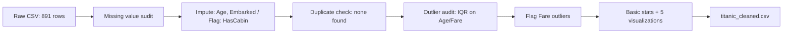

# Task 1 — Data Cleaning & Exploration: Titanic Dataset

| | |
|---|---|
| Dataset | [Titanic — ML from Disaster](https://www.kaggle.com/competitions/titanic/data) (Kaggle), 891 rows × 12 cols |
| Missing values | `Age` (20%) → median by Pclass+Sex · `Cabin` (77%) → `HasCabin` flag, column dropped · `Embarked` (2 rows) → mode |
| Duplicates | 0 found (checked full-row and `PassengerId`) |
| Outliers | `Fare` ~13% by IQR — flagged (`FareOutlier`), not removed, since it's class-driven signal. `Age` clean. |
| Output | `titanic_cleaned.csv`, 5 charts, executed notebook |

<details>
<summary>Dataset details</summary>

Original Kaggle competition data. Pulled via a GitHub-hosted mirror
(`datasciencedojo/datasets/titanic.csv`) — identical content to the Kaggle CSV.
Columns: `PassengerId, Survived, Pclass, Name, Sex, Age, SibSp, Parch, Ticket, Fare, Cabin, Embarked`.

</details>

## Pipeline



## Path note

The notebook currently reads `pd.read_csv("titanic_raw.csv")` and writes `titanic_cleaned.csv` to its
own working directory. With the notebook now living in `notebook/` and the CSVs in `data/`, those paths
need to become `../data/titanic_raw.csv` and `../data/titanic_cleaned.csv` (or run the notebook with
`data/` as the working directory) or the read/write cells will fail. Say the word and I'll make that fix.

## Honest Take

- The dataset's problems are the textbook Titanic ones — nothing hidden, nothing that needed a workaround.
- No duplicates existed. Stating that plainly rather than inventing a cleaning step for it.
- `Fare` outliers are kept and flagged, not scrubbed — they're first-class fares, not data errors, and dropping them would remove real signal ahead of Task 3.
- `Sex` and `Pclass` are already the clearest survival predictors before any modeling — flagging that now so Task 3 isn't a surprise.

## Project structure

```
Task 1/
├── notebook/
│   └── Task1_Titanic_Cleaning_EDA.ipynb   # executed, all outputs present
├── data/
│   ├── titanic_raw.csv              # cleaned output (no separate output/ folder at this stage)
├── images/
│   ├── missing_values.png
│   ├── outliers_boxplot.png
│   ├── distributions.png
│   ├── survival_by_class_sex.png
│   └── correlation_heatmap.png
├── output/
│   ├── titanic_cleaned.csv 
└── README.md
```
