# Task 2 — Exploratory Data Analysis: Titanic Dataset

| | |
|---|---|
| Input | `titanic_cleaned.csv` (Task 1 output) |
| New features | `FamilySize`, `IsAlone`, `Title` (from `Name`), `AgeGroup` |
| Strongest signal | `Sex` × `Pclass` interaction — not additive, sex dominates within class, class still moves the needle |
| Weak signal | `Age` alone — heavy overlap between survivors/non-survivors except at extremes |
| Redundancy flagged | `Fare` / `Pclass` / `HasCabin` are highly correlated — same story, three angles |
| Stat checks | Sex, Pclass, Fare all significant vs. Survived (chi-square / t-test, p << 0.05) |
| Output | `titanic_eda_features.csv`, 5 charts, executed notebook |

<details>
<summary>Dataset details</summary>

Same Titanic data as Task 1, post-cleaning. 891 rows. Engineered fields added in this notebook:
`FamilySize = SibSp + Parch + 1`, `IsAlone`, `Title` extracted via regex from `Name` and collapsed into
5 categories (`Mr, Mrs, Miss, Master, Rare`), `AgeGroup` bucketed into 5 bins.

</details>

## Pipeline

```mermaid
flowchart LR
    A[titanic_cleaned.csv] --> B[Feature engineering: FamilySize, Title, AgeGroup]
    B --> C[Univariate categorical distributions]
    C --> D[Bivariate: each var vs Survived]
    D --> E[Interaction: Class x Sex]
    E --> F[Continuous vs Survived: Age, Fare KDEs]
    F --> G[Correlation matrix + multicollinearity check]
    G --> H[Chi-square / t-test significance checks]
    H --> I[titanic_eda_features.csv]
```



## Key findings

- **Sex is the single strongest split** — women survived at roughly 4x the rate of men.
- **Class × sex interaction is non-additive**: 1st-class women 96.8%, 3rd-class women 50.0%,
  1st-class men 36.9%, 3rd-class men 13.5%. A 3rd-class woman and a 1st-class man had comparable odds —
  sex dominates within class, but class still swings survival 20-40 points inside each sex.
- **FamilySize is non-monotonic** — small families (2-4) outperformed both solo travelers and large
  families, not a straight line.
- **Fare, Pclass, HasCabin are collinear** (`Fare`↔`Pclass` r≈-0.55, `HasCabin`↔`Pclass` r≈-0.73) —
  flagged now so Task 3 doesn't quietly overfit on three proxies for the same thing.
- **Age alone is weak** — distributions overlap heavily between survivors and non-survivors except at
  the child end.

## Path note

The notebook currently reads `pd.read_csv("titanic_cleaned.csv")` and writes `titanic_eda_features.csv`
to its own working directory. With the notebook now in `notebook/`, the input in `data/`, and the output
expected in `output/`, those paths need to become `../data/titanic_cleaned.csv` (read) and
`../output/titanic_eda_features.csv` (write), or the cells will fail / write to the wrong place. Say the
word and I'll make that fix.

## Honest Take

- Most of this dataset's "features" restate `Sex` and `Pclass` from a different angle — that's what the
  data is, not a gap in the analysis.
- The class × sex interaction is the one finding worth carrying into modeling as an actual interaction
  term or a model that finds it automatically (tree-based).
- Multicollinearity between `Fare`/`Pclass`/`HasCabin` is called out plainly rather than left for Task 3
  to discover the hard way.
- Weak relationships (`Age` alone, `Embarked`) are reported as weak — no dressing up a flat chart as a
  finding.

## Project structure

```
Task 2/
├── notebook/
│   └── Task2_Titanic_EDA.ipynb        # executed, all outputs present
├── data/
│   └── titanic_cleaned.csv            # input, from Task 1
├── output/
│   └── titanic_eda_features.csv       # output, with engineered features
├── images/
│   ├── univariate_categoricals.png
│   ├── survival_bivariate.png
│   ├── class_sex_interaction.png
│   ├── continuous_vs_survival.png
│   └── full_correlation_heatmap.png
└── README.md
```
