# Task 3 — Data Analysis & Prediction: Titanic Survival Model

| | |
|---|---|
| Input | `titanic_eda_features.csv` (Task 2 output) |
| Features used | `Pclass, Sex, Age, Fare, Embarked, FamilySize, IsAlone, Title` (8 features) |
| Models | Logistic Regression (Ridge/L2) · Random Forest · XGBoost · Stacking Ensemble |
| CV | `StratifiedKFold(n_splits=3)`, `n_jobs=1`, scored on ROC-AUC |
| Best test ROC-AUC | **Logistic Regression — 0.874** |
| Best test accuracy/F1 | **Stacking Ensemble — 0.860 acc / 0.812 F1** |
| Output | `best_model.joblib`, `model_comparison.csv`, 3 charts, executed notebook |

<details>
<summary>Dataset details</summary>

891 rows, Titanic dataset post-Task-2 feature engineering. Stratified 80/20 train/test split
(`random_state=42`). All preprocessing (scaling, one-hot encoding) fit inside an `sklearn` `Pipeline` on
training data only — no test-set leakage.

</details>

## Note on the model stack

The usual stack is Ridge / Random Forest / XGBoost / Stacking Ensemble — that's a regression lineup.
This is binary classification, so **Logistic Regression with L2 (ridge) penalty** stands in for Ridge.
Flagging the substitution rather than quietly swapping it in.

## Pipeline

```mermaid
flowchart LR
    A[titanic_eda_features.csv] --> B[Feature selection: 8 features, drop redundant]
    B --> C[Stratified 80/20 split]
    C --> D[Pipeline: StandardScaler + OneHotEncoder]
    D --> E[3-fold CV: LR, RF, XGBoost]
    E --> F[Stacking Ensemble: LR meta-learner]
    F --> G[Test-set evaluation: accuracy, precision, recall, F1, ROC-AUC]
    G --> H[Feature importance: RF, XGBoost, LR coefficients]
    H --> I[best_model.joblib]
```



## Model comparison (test set)

| Model | Accuracy | Precision | Recall | F1 | ROC-AUC |
|---|---|---|---|---|---|
| Logistic Regression (Ridge/L2) | 0.838 | 0.813 | 0.754 | 0.782 | **0.874** |
| Stacking Ensemble | **0.860** | 0.844 | **0.783** | **0.812** | 0.869 |
| Random Forest | 0.827 | **0.839** | 0.681 | 0.752 | 0.857 |
| XGBoost | 0.810 | 0.769 | 0.725 | 0.746 | 0.844 |

## Feature importance

- **Random Forest top 3:** `Title_Mr` (0.197), `Sex_male` (0.197), `Fare` (0.142)
- **XGBoost top 3:** `Title_Mr` (0.500 — dominates), `Pclass_3` (0.146), `Title_Rare` (0.115)
- **Logistic Regression top 3 (by |coefficient|):** `Title_Mr` (-1.35), `Sex_male` (-1.29), `Title_Master` (+1.17)

All three methods agree on the same headline variables — `Title`/`Sex` and `Pclass` — matching Task 2's
EDA almost exactly. They disagree on *how much* weight each carries, which is a property of the methods,
not a sign one is wrong.

## Path note

The notebook currently reads `pd.read_csv("titanic_eda_features.csv")` and writes `best_model.joblib` /
`model_comparison.csv` to its own working directory. With the notebook now in `notebook/`, the input in
`data/`, and the outputs expected in `output/`, those paths need to become
`../data/titanic_eda_features.csv` (read) and `../output/best_model.joblib`,
`../output/model_comparison.csv` (write), or the cells will fail / write to the wrong place. Say the
word and I'll make that fix.

## Honest Take

- Plain Logistic Regression posted the best ROC-AUC, beating the Stacking Ensemble — not the usual
  outcome for that stack, but this dataset is small and close to linearly separable (`Sex`/`Pclass`/
  `Title` do most of the work), so a linear model has little reason to lose here.
- Which model is "best" depends on the metric: Logistic Regression wins ranking quality (ROC-AUC),
  Stacking wins hard classification calls (accuracy/F1). Both answers are correct for different
  questions — the deliverable doesn't pretend there's one true winner.
- XGBoost concentrates ~50% of its importance on a single feature (`Title_Mr`) while Random Forest
  spreads more evenly — feature importance is method-dependent, not a fixed ground truth.
- Dropping `HasCabin` in favor of `Fare` (both encode class per Task 2) was a judgment call, not a
  certainty — a reasonable next experiment if more AUC is worth chasing.
- All four models sit in a tight 0.84-0.87 ROC-AUC band — with 8 features and 891 rows, that's close to
  this dataset's ceiling; a fancier model won't move it much further.

## Project structure

```
Task 3/
├── notebook/
│   └── Task3_Titanic_Prediction.ipynb   # executed, all outputs present
├── data/
│   └── titanic_eda_features.csv         # input, from Task 2
├── output/
│   ├── best_model.joblib                # best pipeline by test ROC-AUC (Logistic Regression)
│   └── model_comparison.csv
├── images/
│   ├── roc_curves.png
│   ├── confusion_matrix.png
│   └── feature_importance.png
└── README.md
```
